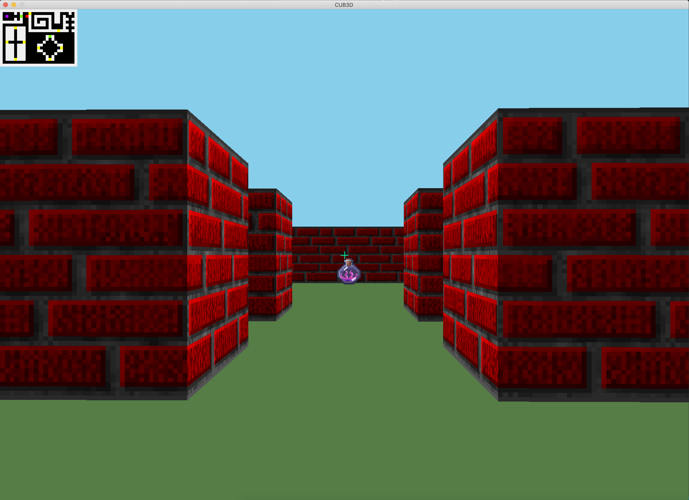

# cub3D - 42 School Project

[](https://github.com/JaeSeoKim/badge42)

## About
* This project is inspired by the world-famous Wolfenstein 3D game, which was the first FPS ever.  
* It will enable you to explore ray-casting.   
* Your goal will be to make a dynamic view inside a maze.


## Controls
| **Control** | **Key**       |
| :----       | :----         |
| walk        | ```W``` / ```A``` / ```S``` / ```D``` |
| rotate      | ```⬅``` / ```⮕``` or ```mouse movement```|
| open doors  | ```SPACE```|
| close doors | ```E```|
| sprint      | ```SHIFT``` (only after collecting "sprint potion")|


## Screenshot


## How to use
Clone the repository:
```bash
https://github.com/42akurz/42_cub3D.git
```
Go to the repository and run make
```bash
make
```
Run the executable together with a map
```bash
./cub3D maps/map5.cub
```
Use clean to delete all object files, fclean to remove all object files and executable and re to recompile the program
```bash
make clean / make fclean / make re
```
## Partner
[42 Heilbronn](https://www.42heilbronn.de/en/) student: [Felix](https://github.com/fharing)
